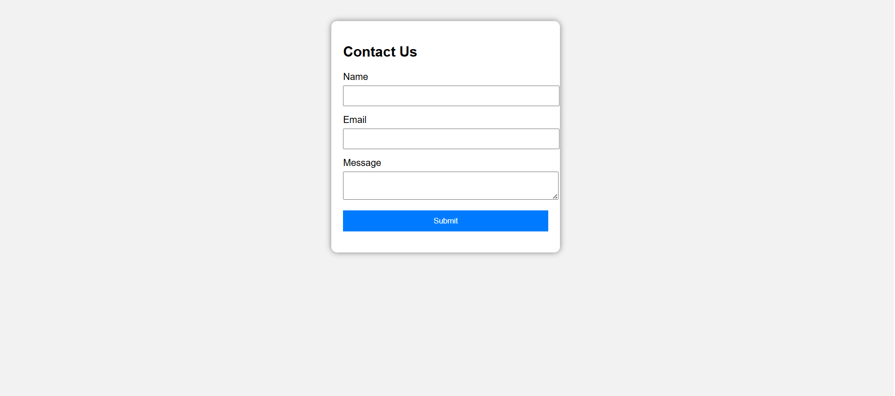

# 📩 Contact Form with JavaScript Validation

This project is a simple **Contact Form** built using **HTML, CSS and JavaScript** with client-side validation.  
It validates user inputs and displays error and success messages dynamically without sending data to a server.

---

## 🎯 Project Objective
The goal of this project is to learn how to handle forms in JavaScript by:
- Creating a contact form
- Validating inputs using JavaScript
- Using Regex for email validation
- Displaying dynamic error messages
- Preventing invalid form submission
- Showing success message on valid submission

---

## 🛠 Tools Used
- VS Code
- Google Chrome Browser
- HTML5
- CSS3
- JavaScript (DOM Manipulation & Regex)

---

## ✨ Features
✔ Name field validation (cannot be empty)  
✔ Email validation using Regular Expression  
✔ Message field validation (cannot be empty)  
✔ Prevents form submission when inputs are invalid  
✔ Displays error messages below each field  
✔ Shows success message when form is valid  
✔ Automatically resets the form after submission  

---

## 🧪 Validation Rules

| Field | Validation |
|------|-------------|
| Name | Must not be empty |
| Email | Must follow valid email format |
| Message | Must not be empty |

---

## 📷 Preview

Add your project screenshot below:

---

## 🚀 How to Run the Project

1. Download or clone this repository  
2. Open the project folder  
3. Double click **index.html**  
4. The form will open in your browser  
5. Test validation by entering different inputs  

---

## 📚 Concepts Learned
- Form handling in JavaScript
- Event handling using addEventListener()
- Preventing default form submission
- DOM manipulation
- Regex pattern matching
- Dynamic error message display
- Client-side validation

---

## 💡 Future Improvements
- Connect form to backend (Node/PHP)
- Store messages in database
- Add mobile responsiveness
- Add dark mode UI

---

## 👩‍💻 Author
**Pradakshina S**
